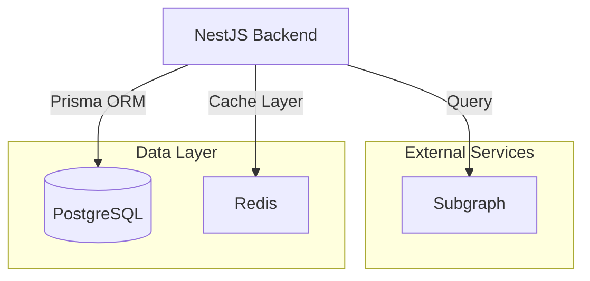

# Node System Backend

[Node System Backend](https://github.com/LFGInc/node-system-be) is built from [NestJS](https://nestjs.com/), responsible for:
- Node and workload management
- Uptime tracking
- Notification when node/workload is down
- Save user reward points

## Architecture

The Node System Backend is simple as below:

It consists of:

- **NestJS Backend**: The main application that handles API requests/responses and cron jobs.
- **PostgreSQL**: The database used for storing node, worqkload, uptime and reward information.
- **Redis**: The cache layer used for storing node/workload status.
- **Subgraph**: For fetching NFT data, user balances.

## Datagram integration

If project owners do not have their own reward distribution system, they can leverage the [Datagram](https://www.datagram.network/). Datagram is the DePIN baselayer — an AI-driven, Hyper-Fabric Network enabling fast, scalable connectivity and DePIN interoperability.

The entire system architecture integration with Datagram is as below:

Each workload now has a Datagram substrate distributed together with its main components. Uptime tracking and reward distribution will be handled by the Datagram network instead of the Node System Backend.