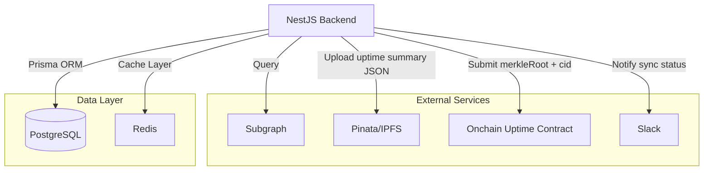

# Node System Backend (BE)

This repository contains the backend system for the Node System project, built using **NestJS**, **Redis**, and **PostgreSQL**. It provides APIs and services for managing nodes, projects, and workloads, with features like uptime tracking, notifications, and data persistence.

## Prerequisites
- Node.js (v22 or higher)
- Docker and Docker Compose
- PostgreSQL and Redis (if not using Docker)

## How to run

1. Run services using Docker Compose (Optional)
   ```bash
   docker-compose up -d
   ```
   This will start PostgreSQL and Redis in the background.
2. Install dependencies:
   ```bash
   pnpm install
   ```
3. Copy the configuration file:
   ```bash
   cp config.example.yaml config.yaml
   ```
4. Update the `config.yaml` file with your own settings.
5. Run the application:
   ```bash
   pnpm dev
   ```

## Folder Structure

```markdown
├── prisma
│   ├── schema          # Contains the Prisma schema file for defining the database structure.
│   └── seed.ts         # Script for seeding the database with initial data.
├── src
│   ├── api
│   │   ├── v1          # Version 1 of the API, organized by feature modules.
│   │   │   ├── inventory      # API endpoints for managing inventory.
│   │   │   ├── node           # API endpoints for managing nodes.
│   │   │   ├── notification   # API endpoints for sending notifications.
│   │   │   ├── project        # API endpoints for managing projects.
│   │   │   ├── user           # API endpoints for user management.
│   │   │   ├── workload       # API endpoints for managing workloads.
│   │   │   └── index.ts       # Entry point for the v1 API module.
│   │   ├── api.module.ts      # Module definition for the API layer.
│   │   ├── api.service.ts     # Service layer for handling API logic.
│   │   └── index.ts           # Entry point for the API directory.
│   ├── app
│   │   # Core application module, typically includes the main application logic.
│   ├── common
│   │   ├── decorators         # Custom decorators for enhancing functionality.
│   │   ├── exceptions         # Custom exception handling logic.
│   │   │   ├── client         # Client-side exceptions.
│   │   │   ├── filters        # Exception filters for handling errors.
│   │   │   └── server         # Server-side exceptions.
│   │   ├── guards             # Authorization and authentication guards.
│   │   ├── helper             # Utility functions and helpers.
│   │   └── interceptors       # Interceptors for modifying request/response behavior.
│   ├── configs
│   │   # Configuration files for the application (e.g., environment settings).
│   ├── modules
│   │   ├── cron               # Cron job scheduling and management.
│   │   ├── mail               # Email service module.
│   │   ├── onchain            # Onchain uptime root submission module.
│   │   ├── pg                 # Direct access PostgreSQL database module.
│   │   ├── prisma             # Prisma ORM integration module.
│   │   ├── redis              # Redis caching and data store module.
│   │   └── uptime             # Uptime monitoring module.
│   ├── third-party
│   │   ├── ipfs               # Pinata/IPFS integration for uptime summaries.
│   │   ├── slack              # Slack notifications for onchain sync status.
│   │   └── thegraph           # Integration with The Graph protocol.
│   └── main.ts                # Entry point for the application.
├── <configuration files> ...
├── README.md
└── tsconfig.json
```


[Node System Backend](https://github.com/LFGInc/node-system-be) is built from [NestJS](https://nestjs.com/), responsible for:

- Node and workload management
- Uptime tracking
- Notification when node/workload is down
- Save user reward points

## Architecture

The Node System Backend is simple as below:


```mermaid
graph TD
    A[NestJS Backend]
    G[Subgraph]
    I[Pinata/IPFS]
    C[Onchain Uptime Contract]
    S[Slack]
    P[(PostgreSQL)]
    R[Redis]

    A -->|Query| G
    A -->|Prisma ORM| P
    A -->|Cache Layer| R
    A -->|Upload uptime summary JSON| I
    A -->|Submit merkleRoot + cid| C
    A -->|Notify sync status| S

    subgraph External Services
        G
        I
        C
        S
    end

    subgraph Data Layer
        P
        R
    end
```

It consists of:

- **NestJS Backend**: The main application that handles API requests/responses and cron jobs.
- **PostgreSQL**: The database used for storing node, workload, uptime and reward information.
- **Redis**: The cache layer used for storing node/workload status.
- **Subgraph**: For fetching NFT data, user balances.
- **Pinata/IPFS**: Stores uptime summary payloads and returns CIDs.
- **Onchain Uptime Contract**: Stores submitted daily/hourly merkle roots and CIDs.
- **Slack**: Receives success/failure notifications for onchain sync.

## Onchain Uptime Module

The backend includes an onchain uptime workflow that publishes hourly and daily uptime checkpoints.

### Flow

1. Cron jobs summarize workload uptime for the target period.
2. Valid summary records are built using:
   - `slug`: workload project code
   - `nodeId`: node address
   - `uptime`: summarized uptime value
3. The summary payload is uploaded to Pinata/IPFS as JSON.
4. The backend receives a `cid` from Pinata.
5. A merkle root is computed from summary records.
6. The backend submits `merkleRoot` + `cid` to the onchain uptime contract:
   - daily via `submitDailyRoot`
   - hourly via `submitHourlyRoot`
7. Slack is notified for success or failure, including type, submit time, root, cid, and tx hash/error.

### Cron Schedules

- Hourly snapshot: `0 0 * * * *` (UTC, top of hour).
- Daily snapshot: `02 02 * * *` (UTC, 02:02).

### Manual Trigger and Status APIs

- `GET /cron/trigger/summarize-uptime?type=daily|hourly&date=<ISO_DATE>`
- `GET /cron/uptime-summary?date=<ISO_DATE>`

Both routes require the header:

- `x-cron-secret: <server.cronSecret>`

### Required Config Keys

```yaml
server:
  cronSecret: <string>

ipfs:
  url: https://uploads.pinata.cloud
  jwt: <pinata_jwt>
  gateway: https://lfg.mypinata.cloud/ipfs/

ether:
  rpcUrl: <rpc_url>
  privateKey: <private_key>
  contractAddress: <uptime_contract_address>

slack:
  token: <slack_bot_token>
  channel: <slack_channel_id>
```
