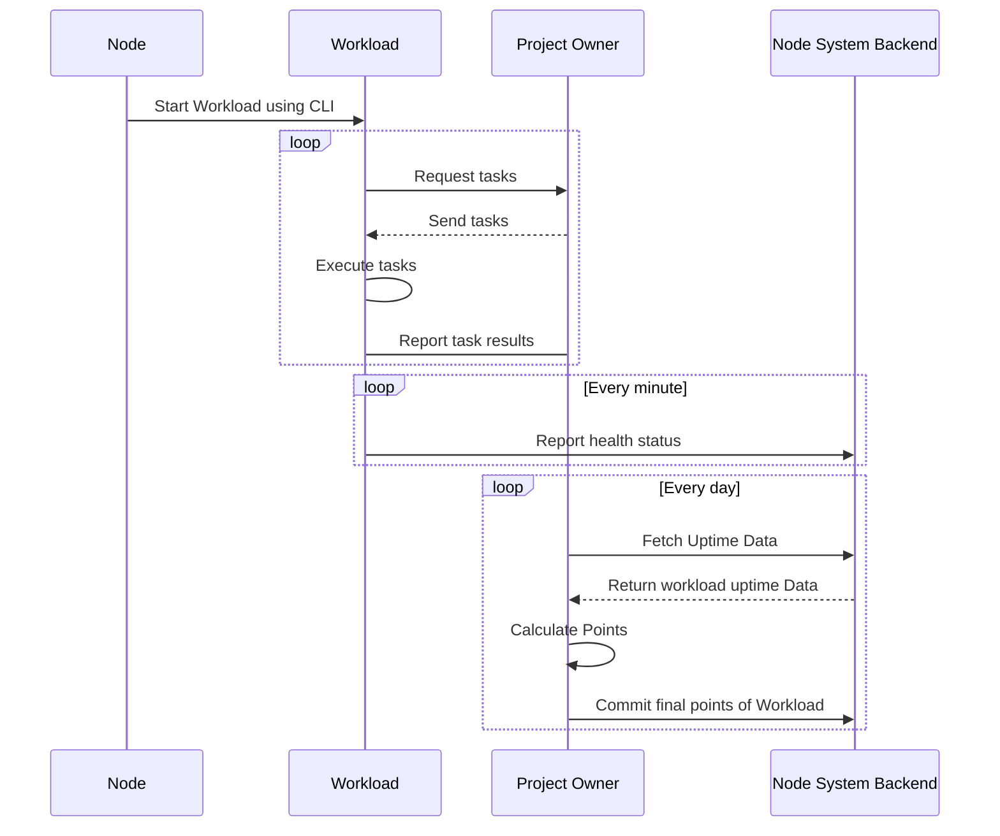

# Node System Documentation

## Overview

The Node System is a DEPIN (Decentralized Physical Infrastructure Network) enabling decentralized workload execution, performance tracking, and reward distribution.

## Stakeholders

1. **Users**: Operate nodes by purchasing NFTs.
2. **Project Owners**: Define workloads and distribute rewards.
3. **Node Operators**: Manage Node CLI and Dashboard.

## Architecture

There are several components in the Node System architecture:

- [**Node CLI**](node-cli.md): Command-line interface for managing a node and its workloads.
- [**Workload Manager**](workload-manager.md): Version control and uptime management for workloads.
- [**Node System Backend**](backend.md): Backend API for managing nodes/workloads, uptime tracking and notification
- *Workload Master*: Hosted by project owners, responsible for defining workloads and distributing rewards.

### Node System Workflow

After purchasing NFTs from project owners, users can operate workloads using the Node CLI. Each NFT serves as a license for running a specific workload.

Users utilize the [Node CLI](node-cli.md) to initialize a K3S cluster on their machines and deploy workloads. Workloads, defined by project owners, run within the K3S cluster. A special hidden workload, called [workload manager](workload-manager.md) is responsible for the following tasks:

- Receiving health checks from workloads and sending their status to the [backend](backend.md) every minute.
- Periodically verifying workload versions and automatically updating them as needed.
- Performing self-updates to ensure it remains up-to-date.

Workloads fetch tasks from project owners, execute them, and report the results back to the respective project owners. 

At the end of each day, project owners calculate points based on workload uptime and task execution results. These points are then committed to the [backend](backend.md) as the final performance metrics.

This is an overview of the Node System workflow:

## Key Features

- **Decentralized Infrastructure**: Distributed workload execution.
- **NFT Licensing**: Simplifies node ownership.
- **Automated Rewards**: Transparent reward distribution.
- **Performance Tracking**: Tracks uptime and workload results.

## Additional Resources

- [What is a Node](https://support.lfg.inc/hc/en-us/articles/26584598844955-What-is-a-Node)
- [Node System Articles](https://support.lfg.inc/hc/en-us/sections/26307301761691-General)