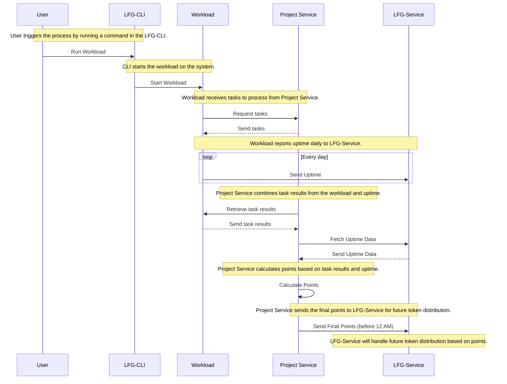

# Node System Documentation

## Overview

The Node System is a DEPIN (Decentralized Physical Infrastructure Network) system designed to facilitate collaboration between Users, Project Owners, and Node Operators. It enables decentralized workload execution, performance tracking, and reward distribution.

### Stakeholders

1. **Users**: Individuals who purchase NFTs from Project Owners and operate nodes.
2. **Project Owners**: Entities that define workloads and distribute rewards based on node performance.
3. **Node Operators**: Entities responsible for distributing the Node CLI and managing the Node Dashboard.

---

## Workflow

1. NFT Purchase and Node Licensing
      - Users purchase NFTs from Project Owners.
      - Each NFT grants the user a node license.
2. Node Installation and Registration
      - Users install the Node CLI distributed by the Node Operator.
      - After installation, each node is assigned a unique address.
      - Users register their node address on the Node Operator's dashboard.
3. Workload Assignment
      - Project Owners define workloads for the nodes.
      - Users can add workloads to their nodes via the Node Dashboard.
4. Workload Execution and Reporting
      - Workloads run on the nodes and generate reports:
          - **Uptime**: Sent to the Node Operator.
          - **Workload Performance/Job Completion**: Sent to the Project Owner.
5. Reward Calculation and Distribution
      - At the end of each day:
          - Project Owners calculate rewards based on job execution results and uptime.
          - Project Owners are responsible for distributing rewards to Users.

## System Architecture

### 1. Node Operator
- **Node CLI**: A command-line interface for node installation and management.
- **Node Dashboard**: A web-based interface for node registration and monitoring.
- **Node Workload Manager**: A tool for managing workloads assigned to nodes.

### 2. Project Owner
- Defines workloads and calculates rewards for Users.

---

## Key Features

- **Decentralized Infrastructure**: Enables distributed workload execution and reporting.
- **NFT-Based Licensing**: Simplifies node licensing and ownership.
- **Automated Reward System**: Ensures fair and transparent reward distribution.
- **Performance Tracking**: Tracks uptime and workload performance for accountability.

---

## Getting Started

### For Users
1. Purchase an NFT from a Project Owner.
2. Install the Node CLI provided by the Node Operator.
3. Register your node address on the Node Dashboard.
4. Add workloads to your node and start earning rewards.

### For Project Owners
1. Define workloads for nodes.
2. Monitor workload execution and performance.
3. Calculate and distribute rewards to Users.

### For Node Operators
1. Distribute the Node CLI to Users.
2. Manage the Node Dashboard for node registration and monitoring.
3. Oversee the Node Workload Manager for workload assignments.

---

## Additional Resources

- [Node CLI Documentation](NodeCLI/index.md)
- [Workload Manager Documentation](WorkloadManager/index.md)
- [API Documentation](API/index.md)