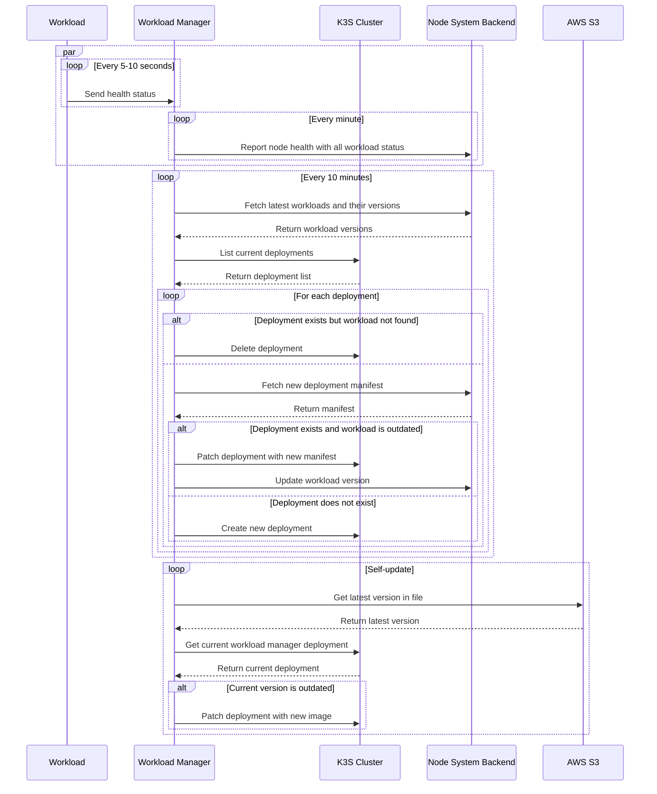

# Node System Workload Manager

[Node system workload manager](https://github.com/LFGInc/node-system-workload-management) is a specific workload runs on user's node, inside the K3S cluster. It is built from [Express JS](https://expressjs.com/) with minimal codebase and dependencies. Workload manager is responsible for:

- Workload version control
- Uptime management
- Health check and reporting
- Self-update
- Sync the node system state with configuration saved in the backend

## Prerequisites

- Your node system must be started with the [`lfgnode start`](https://github.com/LFGInc/node-cli?tab=readme-ov-file#core-commands) command.
- [Node](https://nodejs.org/en/download) v22 or later
- `pnpm` package manager

## How to run

1. Copy the `.env.example` file to `.env` and fill in the required environment variables.
   - `NODE_SYSTEM_ENDPOINT`: The endpoint of the node system backend.
   - `NODE_PRIVATE_KEY`: The private key generated by the node CLI. You can find it at `~/.config/lfgnode/config.yaml`.
   - `SENTRY_DSN`: The [Sentry](https://sentry.io/) DSN for error tracking.
2. Install the dependencies:
   ```bash
   pnpm install
   ```
3. Run the workload manager:
   ```bash
   pnpm dev
   ```

Note that you are running the workload manager outside of the K3S cluster, just for debugging and developing. The actual manager is automatically deployed inside the K3S cluster when you run the `lfgnode start` command. 

## Workflows

