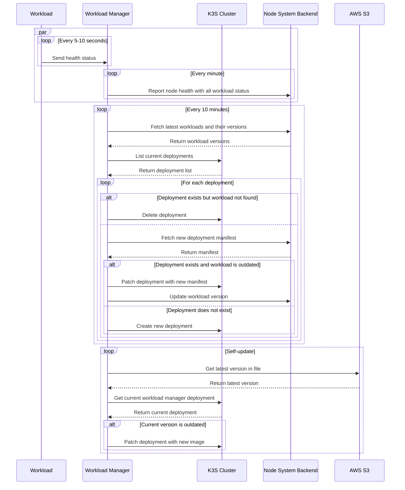

# Workload Manager

[Node system workload manager](https://github.com/LFGInc/node-system-workload-management) is a specific workload runs on user's node, inside the K3S cluster. It is built from [Express JS](https://expressjs.com/) with minimal codebase and dependencies. Workload manager is responsible for:

- Workload version control
- Uptime management
- Health check and reporting
- Self-update
- Sync the node system state with configuration saved in the backend

## Workflow

